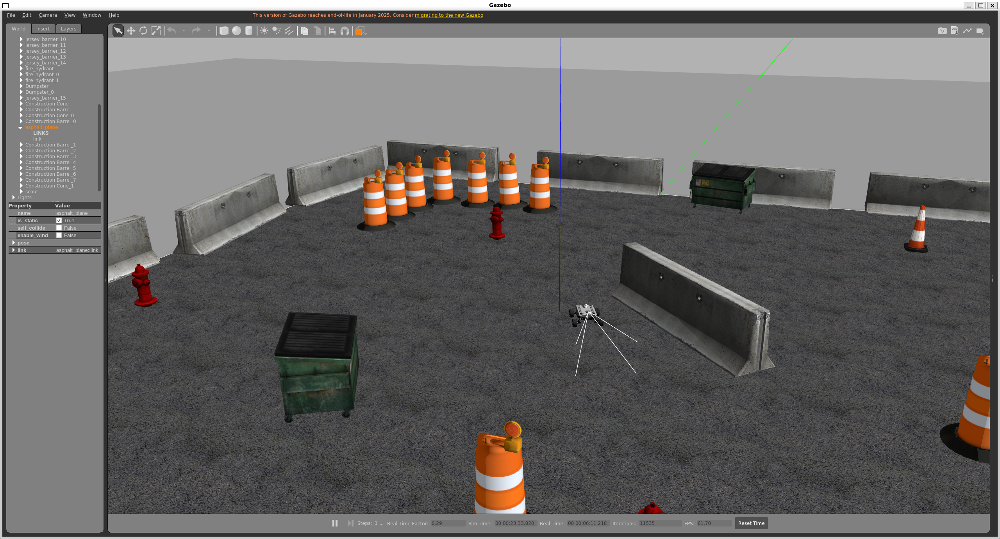
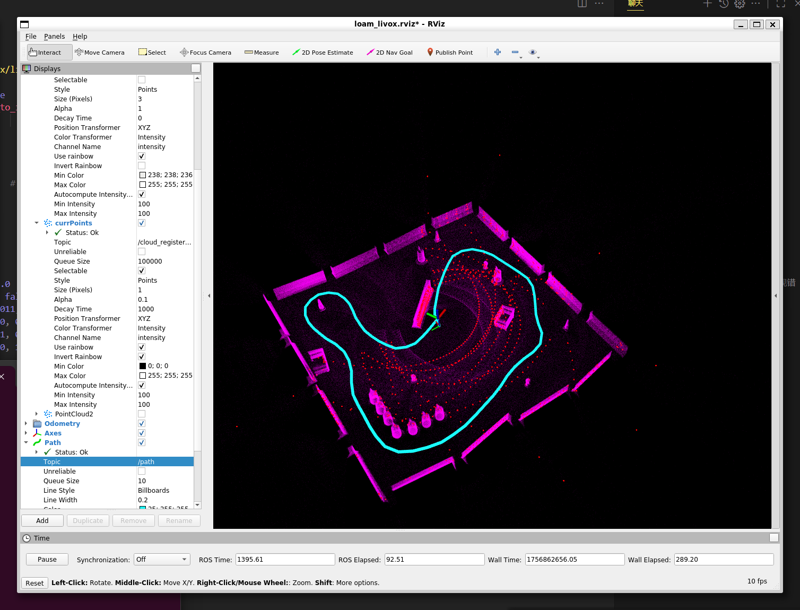

# AuToGo_robot_sim

A multi-functional mobile robot simulation platform based on `ROS1 Noetic` and `Gazebo 11`.

This repository provides a practical environment for robotics research and prototyping, covering SLAM, EKF-based localization, navigation, and Fast-LIO point-cloud mapping. It also integrates `Livox Mid-360` simulation support for multi-scene localization and navigation experiments.

## Overview

`AuToGo_robot_sim` is intended as a reusable simulation baseline for:

- robotics learning and experimentation
- SLAM and navigation prototyping
- sensor integration testing
- validating algorithms before deployment on real robots

The current public scope focuses on:

- multi-scene Gazebo simulation
- 2D and 3D sensor simulation
- EKF localization
- 2D SLAM with GMapping
- autonomous navigation with the ROS Navigation Stack
- Fast-LIO experiments with Livox Mid-360

## Features

### Simulation worlds

- `scout_mini_empty_world.launch`: empty scene with sensors
- `scout_mini_playpen.launch`: playpen test scene with sensors and optional 3D setup
- `scout_mini_house.launch`: house scene with sensors
- `scout_empty_world.launch`: empty world without sensors

### Sensor simulation

- 2D LiDAR
- 3D LiDAR: `VLP-16`, `HDL-32E`, `Mid-360`
- IMU
- GPS
- RGB camera
- depth camera

### Supported workflows

- EKF-based localization
- 2D SLAM with `GMapping`
- autonomous navigation with the ROS Navigation Stack
- Fast-LIO mapping with `Livox Mid-360`

## System Requirements

- Ubuntu 20.04
- ROS Noetic
- Gazebo 11

Main dependencies include:

- `slam_gmapping`
- `navigation`
- `robot_localization`
- `tf2_sensor_msgs`

Additional ROS dependencies can be installed with `rosdep`.

## Installation

### Simulation workspace

```bash
mkdir -p ~/autogo_ws/src && cd ~/autogo_ws/src

git clone https://github.com/DWDROME/AuToGo_robot_sim.git
git clone https://github.com/DWDROME/Mid360_simulation_plugin.git

chmod +x AuToGo_robot_sim/install_packages.sh
./AuToGo_robot_sim/install_packages.sh

cd ~/autogo_ws
rosdep install --from-paths src --ignore-src -r -y

sudo apt install -y python3-catkin-tools
catkin build

source devel/setup.bash
```

### Fast-LIO workspace

It is recommended to keep Fast-LIO in a separate workspace:

```bash
mkdir -p ~/fastlio_ws/src && cd ~/fastlio_ws/src
git clone https://github.com/hku-mars/FAST_LIO.git
git clone https://github.com/Livox-SDK/livox_ros_driver2.git
cd ..
catkin_make
```

`Fast-LIO` depends on `livox_ros_driver` by default, so this setup uses `livox_ros_driver2` instead. See `doc/fastlio.md` for notes about topics and integration details.

## Launch Gazebo Simulation

The repository currently provides three sensor-enabled worlds and one empty world:

```bash
roslaunch scout_gazebo_sim scout_mini_empty_world.launch
roslaunch scout_gazebo_sim scout_mini_playpen.launch
roslaunch scout_gazebo_sim scout_mini_house.launch
roslaunch scout_gazebo_sim scout_empty_world.launch
```



## Run the Algorithms

### Fast-LIO simulation

```bash
roslaunch scout_gazebo_sim scout_mini_playpen.launch
roslaunch fast_lio mapping_mid360.launch
```

Default topics:

- IMU topic: `/imu`
- point cloud topic: `/livox/lidar`

Small local adjustments may be needed for topic names, TF settings, and sensor frequency. See `doc/fastlio.md` for details.



### 2D SLAM and navigation

```bash
roslaunch scout_gazebo_sim scout_mini_playpen.launch
roslaunch scout_filter ekf_filter_cmd.launch
roslaunch scout_slam scout_slam.launch
roslaunch scout_navigation scout_navigation.launch
```

Then use `2D Nav Goal` in RViz to send the navigation target.

For mapping notes, see `doc/gmapping.md`.

## Repository Layout

The main project layout is:

- `scout_gazebo_sim/`: Gazebo worlds, models, robot assets, and sensor plugins
- `scout_bringup/scout_filter/`: EKF fusion configuration
- `scout_bringup/scout_slam/`: 2D SLAM launch files and saved maps
- `scout_bringup/scout_navigation/`: navigation launch files
- `scout_bringup/scout_teleop/`: teleoperation utilities
- `doc/`: project notes, screenshots, and workflow documents

## Documentation

Detailed project notes are currently stored in:

- `doc/simulation.md`
- `doc/sensors.md`
- `doc/fastlio.md`
- `doc/gmapping.md`

`doc/navigation.md` is still incomplete and will be expanded in a future update.

## Roadmap

Planned maintenance work includes:

- improve English documentation coverage
- make Fast-LIO setup more reproducible
- expand navigation workflow documentation
- prepare a cleaner baseline for future open-source navigation library work

## Known Limitations

- The project currently targets `ROS1 Noetic` on Ubuntu 20.04.
- Some detailed workflow documents remain in Chinese.
- Fast-LIO setup may require environment-specific topic and TF adjustments.
- Navigation documentation is not yet complete.

## Contributing

Issues and pull requests are welcome.

If you report a bug, please include:

- your environment
- the launch file you used
- the exact command you ran
- logs, screenshots, or topic information when possible

For contribution expectations, see `CONTRIBUTING.md`.

## Security

If you discover a security-sensitive issue, please follow `SECURITY.md` instead of posting full details publicly.

## License

This project is licensed under the Apache License 2.0. See `LICENSE` for details.

## Citation

If you use `AuToGo_robot_sim` in your research, please cite it as:

```bibtex
@misc{Chen2025_AuToGoRobotSim,
  author       = {Ziyang Chen},
  title        = {AuToGo_robot_sim: A Multi-Functional Mobile Robot Simulation Platform for ROS1 Noetic and Gazebo},
  year         = {2025},
  publisher    = {GitHub},
  howpublished = {\url{https://github.com/DWDROME/AuToGo_robot_sim}},
  note         = {Open-source simulation platform with SLAM, EKF, Navigation, and Fast-LIO support}
}
```
